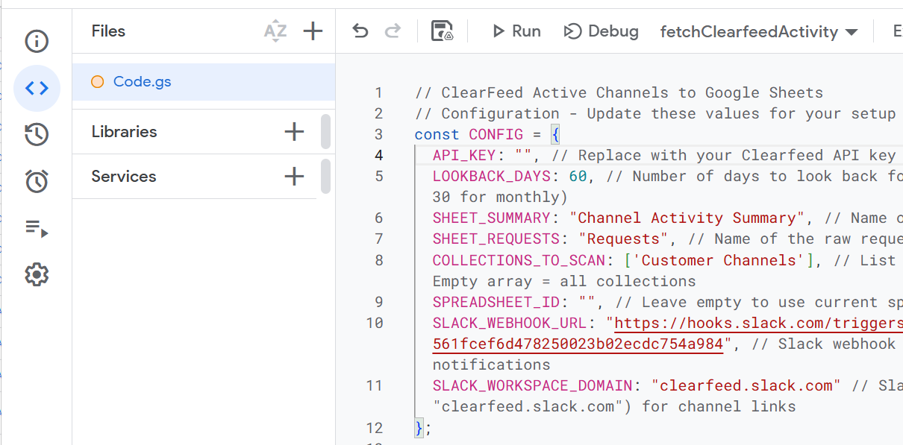
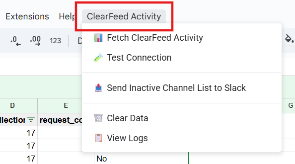

# ClearFeed Active Channels Tracker for Google Sheets

Track which of your ClearFeed channels have been active in the last N days with this Google Apps Script integration. The script analyzes your channels and requests to create an activity summary that helps identify inactive or underutilized channels.

## Prerequisites

Before you begin, make sure you have:

1. **A Google Account** with access to Google Sheets and Google Apps Script
2. **A ClearFeed API Token** (see [Personal Access Token](https://docs.clearfeed.ai/clearfeed-help-center/account-settings/developer-settings#personal-access-token))

## Quick Start Guide

### Step 1: Create a New Google Sheet

1. Go to [Google Sheets](https://sheets.google.com)
2. Click the **"+ Blank"** button to create a new spreadsheet
3. Give your spreadsheet a meaningful name like "ClearFeed Channel Activity Tracker"

### Step 2: Open Google Apps Script

1. In your Google Sheet, click on **Extensions** in the menu bar
2. Select **Apps Script** from the dropdown menu
3. This will open the Google Apps Script editor in a new tab


### Step 3: Add the ClearFeed Activity Script

1. In the Apps Script editor, you'll see a default `Code.gs` file
2. Delete all the existing code in the editor
3. Copy the script code from the [`find_active_channels.gs`](./find_active_channels.gs) file in this folder
4. Paste the entire script into the editor
5. Click the **Save** button (💾) or press `Ctrl+S` (Windows) / `Cmd+S` (Mac)



### Step 4: Configure the Script

At the top of the script, you'll find a `CONFIG` section that needs to be customized:

```javascript
const CONFIG = {
  API_KEY: "", // Replace with your Clearfeed API key
  LOOKBACK_DAYS: 7, // Number of days to look back for activity
  SHEET_SUMMARY: "Channel Activity Summary", // Name of the summary sheet tab
  SHEET_REQUESTS: "Requests", // Name of the raw requests sheet tab
  COLLECTIONS_TO_SCAN: [], // List of collection names to scan
  SPREADSHEET_ID: "", // Leave empty to use current spreadsheet
  SLACK_WEBHOOK_URL: "", // Slack webhook URL for notifications (optional)
  SLACK_WORKSPACE_DOMAIN: "" // Slack workspace domain for channel links (optional)
};
```

**Required Configuration:**

1. **API_KEY**: Replace the empty string with your ClearFeed API token
   ```javascript
   API_KEY: "your-clearfeed-api-token-here"
   ```

**Optional Configuration:**

2. **LOOKBACK_DAYS**: Number of days to look back for channel activity
   - `7` (default): Weekly activity check
   - `30`: Monthly activity check
   - `90`: Quarterly activity check

3. **SHEET_SUMMARY**: Name of the sheet tab where the channel activity summary will be stored (default: "Channel Activity Summary")

4. **SHEET_REQUESTS**: Name of the sheet tab where raw request data will be stored (default: "Requests")

5. **COLLECTIONS_TO_SCAN**: List of collection names to filter channels by
   - Empty array `[]`: Include all collections (default)
   - Example: `["Enterprise Customers", "Trial Users"]` - Only scan channels from these collections

6. **SPREADSHEET_ID**: Leave empty to use the current spreadsheet

7. **SLACK_WEBHOOK_URL**: Slack webhook URL to send inactive channel notifications
   - Leave empty if you don't want Slack notifications
   - To create a webhook: In Slack, open **Workflow Builder**, create a workflow with a **Webhook** trigger, add a **Send message** step with `{{text}}`, and copy the webhook URL
   - The webhook will send a formatted message listing all inactive channels grouped by collection

8. **SLACK_WORKSPACE_DOMAIN**: Slack workspace domain for clickable channel links
   - Leave empty if you don't want channel links
   - Format: `"your-workspace.slack.com"` (e.g., `"clearfeed.slack.com"`)
   - When set, channel names in the spreadsheet become clickable hyperlinks
   - When set, Slack notifications include clickable links to each channel
   - Channel links format: `https://your-workspace.slack.com/archives/CHANNEL_ID`

### Step 5: Save and Test the Connection

1. After updating the configuration, save the script again
2. Refresh your Google Sheet tab (the menu will appear after refresh)
3. You should see a new **"ClearFeed Activity"** menu in the menu bar
4. Click **"ClearFeed Activity"** > **"🧪 Test Connection"** to verify your API token

### Step 6: Grant Permissions

When you run the script for the first time, Google will ask for permissions:

1. Click **"Review permissions"**
2. Choose your Google account
3. Click **"Advanced"** if you see a warning screen
4. Click **"Go to [Your Project Name] (unsafe)"**
5. Click **"Allow"** to grant the necessary permissions

### Step 7: Fetch Channel Activity

1. Click **"ClearFeed Activity"** > **"📊 Fetch ClearFeed Activity"**
2. The script will:
   - Fetch all channels from your ClearFeed workspace
   - Fetch all requests from the last N days
   - Create a summary showing which channels had activity
   - Store raw request data in a separate sheet
3. You'll see a success message with the activity statistics



## Understanding the Output

### Channel Activity Summary Sheet

The summary sheet contains one row per channel with the following columns:

| Column | Description |
|--------|-------------|
| `channel_id` | Internal ClearFeed ID for the channel |
| `channel_name` | Name of the channel (clickable link to Slack if SLACK_WORKSPACE_DOMAIN is configured) |
| `collection_name` | Name of the collection this channel belongs to |
| `collection_id` | Internal ClearFeed ID for the collection |
| `was_active_last_N_days` | "Yes" if channel had requests in the lookback period, "No" otherwise (column name dynamically shows N days from LOOKBACK_DAYS, e.g., `was_active_last_7_days`) |
| `request_count` | Number of requests created in this channel during the lookback period |

### Requests Sheet

The raw requests sheet contains detailed information about each request found during the lookback period, including all standard ClearFeed request fields.

## Using the Custom Menu

Once set up, you'll have a **"ClearFeed Activity"** menu in your Google Sheet with these options:

- **📊 Fetch ClearFeed Activity**: Manually trigger activity analysis (fetches data for last N days)
- **🧪 Test Connection**: Verify your API connection is working
- **📤 Send Inactive Channel List to Slack**: Send a summary of inactive channels to a configured Slack webhook
- **🗑️ Clear Data**: Clear all activity and request data from the sheets
- **📋 View Logs**: Instructions for viewing detailed logs

## Use Cases

### 1. Weekly Channel Health Check

Set `LOOKBACK_DAYS: 7` and run the script weekly to identify channels that haven't had any requests in the past week.

### 2. Monthly Activity Report

Set `LOOKBACK_DAYS: 30` and run monthly to get a broader view of channel utilization.

### 3. Collection-Specific Analysis

Use `COLLECTIONS_TO_SCAN` to focus on specific collections:

```javascript
COLLECTIONS_TO_SCAN: ["Enterprise Customers", "High Priority Support"]
```

This is useful when you want to focus on important customer segments while excluding internal or test collections.

### 4. Identify Inactive Channels for Cleanup

Sort the summary sheet by `was_active_last_N_days` to quickly identify channels that may need attention or removal.

### 5. Send Automated Slack Notifications

Configure a Slack webhook to automatically notify your team about inactive channels:

1. In Slack, open **Workflow Builder** and create a new workflow
2. Add a **Webhook** trigger (this gives you a webhook URL)
3. Add a **Send message** step to post to a channel
4. In the message box, enter: `{{text}}`
5. Copy the webhook URL from the trigger
6. Add the webhook URL to `SLACK_WEBHOOK_URL` in the CONFIG
7. (Optional) Set `SLACK_WORKSPACE_DOMAIN` to include channel links
8. Run **"Fetch ClearFeed Activity"** to get the latest data
9. Click **"Send Inactive Channel List to Slack"** to post the report

The Slack message includes:
- Total count of inactive channels
- Channels grouped by collection
- The lookback period used for analysis
- (Optional) Channel links if `SLACK_WORKSPACE_DOMAIN` is configured

Example Slack message format (without workspace domain):
```
📢 ClearFeed Channel Activity Report

Found 12 inactive channels in the last 7 days:

Enterprise Customers (5 channels):
  • #customer-support-legacy
  • #enterprise-onboarding-old
  • ...

Trial Users (7 channels):
  • #trial-feedback-archive
  • ...
```

Example Slack message format (with `SLACK_WORKSPACE_DOMAIN: "clearfeed.slack.com"`):
```
📢 ClearFeed Channel Activity Report

Found 12 inactive channels in the last 7 days:

Enterprise Customers (5 channels):
  • clearfeed-customer-support-legacy (https://clearfeed.slack.com/archives/C02G9410BB3)
  • clearfeed-enterprise-onboarding-old (https://clearfeed.slack.com/archives/C03H1234567)
  • ...

Trial Users (7 channels):
  • clearfeed-trial-feedback-archive (https://clearfeed.slack.com/archives/C04J9876543)
  • ...
```

## Setting Up Automatic Refresh

You can automate the script to refresh your channel activity data on a schedule using Google Apps Script Triggers. This ensures your data stays up-to-date without manual intervention.

### How to Add a Time-Based Trigger

1. **Open the Apps Script Editor:**
   - In your Google Sheet, go to **Extensions** > **Apps Script**
   - The script editor will open in a new tab

2. **Open the Triggers Panel:**
   - Click on the **clock icon** (⏰) in the left sidebar
   - This opens the "Triggers" panel

3. **Create a New Trigger:**
   - Click the **+ Add Trigger** button (blue button in the bottom right)
   - Configure the trigger with these settings:
     - **Choose which function to run:** `fetchClearfeedActivity`
     - **Select event source:** `Time-driven`
     - **Select type of time based trigger:** Choose your preference:
       - `Day timer` - Runs at a specific time daily
       - `Week timer` - Runs on specific days of the week
       - `Month timer` - Runs on specific days of the month
     - **Select time of day:** Choose when the trigger should run
     - **Error notification settings:** Choose how to be notified of failures (recommended: "Notify me immediately")

4. **Save the Trigger:**
   - Click **Save**
   - You may need to grant additional permissions for the trigger to run

### Recommended Trigger Configurations

**Daily refresh (recommended):**
- Type: `Day timer`
- Time: `6am to 7am` (or your preferred time)
- This ensures you start each day with fresh data

**Weekly refresh:**
- Type: `Week timer`
- Day of week: `Monday`
- Time: `6am to 7am`

**Monthly refresh:**
- Type: `Month timer`
- Day of month: `1` (first day of each month)
- Time: `6am to 7am`

### How Automatic Refresh Works

When the trigger runs, the `fetchClearfeedActivity` function:
1. **Automatically clears** all old data from both sheets
2. Fetches fresh data from ClearFeed API
3. Updates the summary and requests sheets with new data
4. Runs silently in the background (no alerts shown)

**Note:** The `fetchClearfeedActivity` function clears the sheets automatically before fetching new data - you don't need to manually clear data first.

### Automating Slack Notifications

To automatically send inactive channel reports to Slack on a schedule, create an additional trigger:

1. Follow the same steps to create a new trigger
2. **Choose which function to run:** `sendInactiveChannelsToSlack`
3. Set your preferred schedule (daily, weekly, etc.)
4. **Important:** Make sure the automatic refresh trigger runs **before** the Slack notification trigger so the notification has fresh data

Example schedule:
- Refresh trigger: `Day timer` at `6am`
- Slack notification trigger: `Day timer` at `9am`

## Configuration Options Explained

### API_KEY
Your ClearFeed API token. This is required and must be kept secure. Contact ClearFeed support if you need help obtaining this token.

### LOOKBACK_DAYS
Controls how far back to look for channel activity:
- **7 days** (default): Good for weekly health checks
- **30 days**: Good for monthly reports
- **90 days**: Good for quarterly reviews

### COLLECTIONS_TO_SCAN
Filter which collections to include in the analysis:
- **Empty array `[]`**: Include all collections
- **Array of names**: Only include channels from these collections
- Comparison is case-insensitive

### SLACK_WEBHOOK_URL
Optional webhook URL for sending inactive channel notifications to Slack:
- **Leave empty** (`""`): Disable Slack notifications (default)
- **Set to URL**: Enable notifications when using "Send Inactive Channel List to Slack" menu option
- Create a webhook using Slack **Workflow Builder** (not Incoming Webhooks):
  1. In Slack, open Workflow Builder
  2. Create a new workflow
  3. Add a "Webhook" trigger and copy the webhook URL
  4. Add a "Send message" step to post to a channel
  5. In the message box, enter: `{{text}}`

### SLACK_WORKSPACE_DOMAIN
Optional Slack workspace domain for generating clickable channel links:
- **Leave empty** (`""`): Channel names appear as plain text (default)
- **Set to domain**: Channel names become clickable hyperlinks in both spreadsheet and Slack messages
- Format: `"your-workspace.slack.com"` (e.g., `"acme-corp.slack.com"`)
- Links format: `https://your-workspace.slack.com/archives/CHANNEL_ID`
- Find your workspace domain in Slack's URL (e.g., `https://acme-corp.slack.com`)

## Frequently Asked Questions

### Q: Can I track different collections separately?
**A:** Yes! You can:
1. Create multiple Google Sheets
2. Set up the script separately for each sheet
3. Configure each with different `COLLECTIONS_TO_SCAN` values

### Q: How often should I run the activity check?
**A:** This depends on your needs:
- **Weekly**: Set `LOOKBACK_DAYS: 7` and run weekly
- **Monthly**: Set `LOOKBACK_DAYS: 30` and run monthly
- **Ad-hoc**: Run whenever you need to check channel health

### Q: What does the activity column name mean?
**A:** The column name dynamically reflects your `LOOKBACK_DAYS` setting. For example:
- With `LOOKBACK_DAYS: 7`, the column is named `was_active_last_7_days`
- With `LOOKBACK_DAYS: 30`, the column is named `was_active_last_30_days`

A channel is marked as "Yes" (active) if at least one request was created in that channel during the lookback period, "No" otherwise.

### Q: Can I customize the lookback period?
**A:** Yes! Simply change the `LOOKBACK_DAYS` value in the CONFIG section. You can set it to any positive integer (e.g., 14 for two weeks, 60 for two months).

### Q: The script shows an error. How do I troubleshoot?
**A:**
1. Use the **"🧪 Test Connection"** option from the ClearFeed Activity menu
2. Check the Apps Script logs: In the editor, go to **View > Logs**
3. Verify your API token is correct
4. Make sure collection names in `COLLECTIONS_TO_SCAN` match exactly (case-insensitive)

### Q: Can I automate this to run on a schedule?
**A:** Yes! See the **"Setting Up Automatic Refresh"** section below for detailed instructions on configuring time-based triggers.

### Q: How do I set up Slack notifications?
**A:**
1. In Slack, open **Workflow Builder** and create a new workflow
2. Add a **Webhook** trigger (this gives you a webhook URL)
3. Add a **Send message** step to post to a channel
4. In the message box, enter: `{{text}}`
5. Copy the webhook URL from the trigger
6. Paste it into `SLACK_WEBHOOK_URL` in the CONFIG
7. (Optional) For channel links, set `SLACK_WORKSPACE_DOMAIN` to your workspace domain
8. Run "Fetch ClearFeed Activity" first, then "Send Inactive Channel List to Slack"

### Q: What does the Slack notification look like?
**A:** The Slack message shows:
- A summary header with the total inactive channel count
- Channels grouped by collection for easy scanning
- The lookback period (e.g., "last 7 days")
- A footer reminding users to refresh the data
- (Optional) Clickable links to each channel if `SLACK_WORKSPACE_DOMAIN` is configured

## Data Structure

The script fetches data from two ClearFeed API endpoints:

1. **GET /collections?include=channels**: Fetches all collections and their channels
2. **GET /requests**: Fetches requests from the lookback period with pagination

Channel activity is determined by checking if any requests were created in each channel during the specified time period.

## Troubleshooting

### Common Issues

**"API request failed" error:**
- Verify your API token is correct
- Check that your ClearFeed account has API access
- Ensure the token hasn't expired

**"Permission denied" error:**
- Re-run the permission grant process
- Make sure you're using the same Google account for both Sheets and Apps Script

**No channels appearing:**
- Check if you have collections and channels set up in ClearFeed
- Verify your `COLLECTIONS_TO_SCAN` names match your actual collection names (case-insensitive)

**All channels show as inactive:**
- Check the `LOOKBACK_DAYS` setting - it might be too short
- Verify there are actually requests in your ClearFeed workspace
- Check the Requests sheet to see if any data was fetched

**Slack webhook not sending:**
- Verify `SLACK_WEBHOOK_URL` is set in the CONFIG
- Make sure you've run "Fetch ClearFeed Activity" first to populate the summary sheet
- Check the webhook URL is correct and the channel/destination still exists in Slack
- View the Apps Script logs for detailed error messages

## Support and Customization

For additional features, custom filtering options, or integration support, please contact ClearFeed support at [support@clearfeed.app](mailto:support@clearfeed.app).

## Security Notes

- Keep your API token secure and don't share it
- The script runs in your Google account and only you have access to it
- Data is stored in your Google Sheets and follows Google's security policies
- Consider using a dedicated Google account for automated processes in enterprise environments
