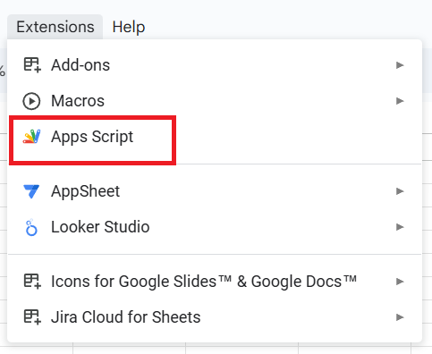
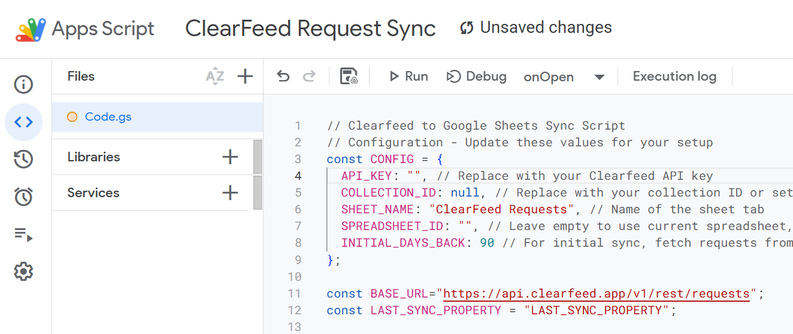
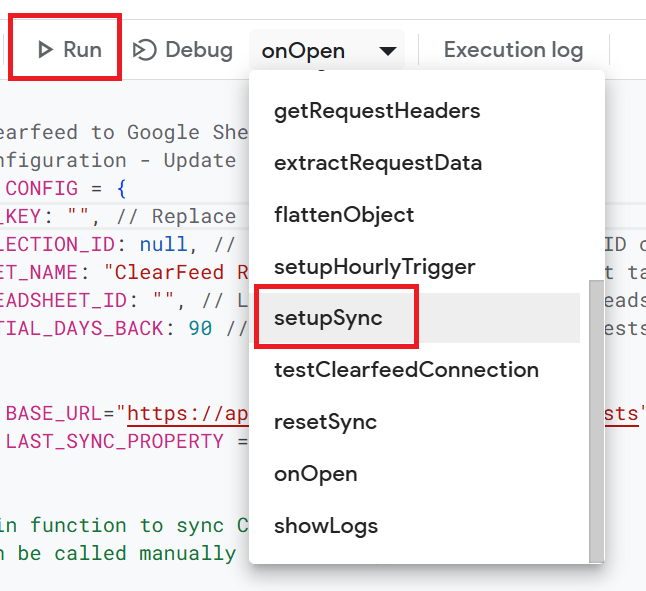
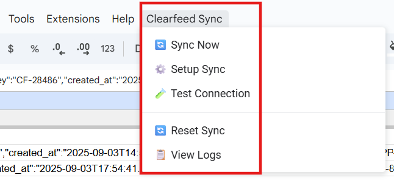
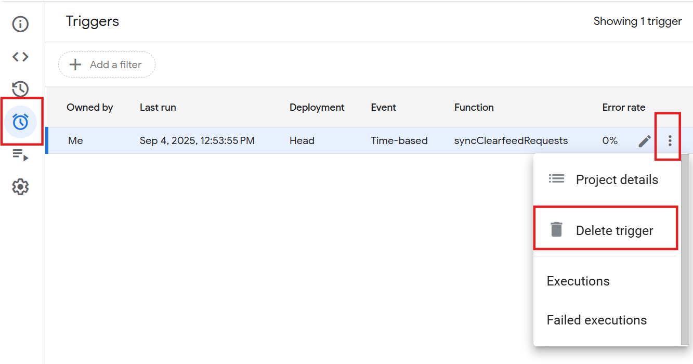

# ClearFeed to Google Sheets Sync

Automatically sync your ClearFeed requests to Google Sheets with this Google Apps Script integration. The script runs hourly to keep your spreadsheet up-to-date with the latest request data from ClearFeed.

## Prerequisites

Before you begin, make sure you have:

1. **A Google Account** with access to Google Sheets and Google Apps Script
2. **A ClearFeed API Token** (see [Personal Access Token](https://docs.clearfeed.ai/clearfeed-help-center/account-settings/developer-settings#personal-access-token))

## Quick Start Guide

### Step 1: Create a New Google Sheet

1. Go to [Google Sheets](https://sheets.google.com)
2. Click the **"+ Blank"** button to create a new spreadsheet
3. Give your spreadsheet a meaningful name like "ClearFeed Requests Dashboard"

### Step 2: Open Google Apps Script

1. In your Google Sheet, click on **Extensions** in the menu bar
2. Select **Apps Script** from the dropdown menu
3. This will open the Google Apps Script editor in a new tab



### Step 3: Add the ClearFeed Sync Script

1. In the Apps Script editor, you'll see a default `Code.gs` file
2. Delete all the existing code in the editor
3. Copy the script code from the [`request_sync.gs`](./request_sync.gs) file in this folder
4. Paste the entire script into the editor
5. Click the **Save** button (💾) or press `Ctrl+S` (Windows) / `Cmd+S` (Mac)



### Step 4: Configure the Script

At the top of the script, you'll find a `CONFIG` section that needs to be customized:

```javascript
const CONFIG = {
  API_KEY: "", // Replace with your Clearfeed API key
  COLLECTION_ID: null, // Replace with your collection ID or set to null/empty to fetch from all collections
  SHEET_NAME: "ClearFeed Requests", // Name of the sheet tab
  SPREADSHEET_ID: "", // Leave empty to use current spreadsheet, or specify ID
  INITIAL_DAYS_BACK: 14 // For initial sync, fetch requests from this many days back
};
```

**Required Configuration:**

1. **API_KEY**: Replace the empty string with your ClearFeed API token
   ```javascript
   API_KEY: "your-clearfeed-api-token-here"
   ```

**Optional Configuration:**

2. **COLLECTION_ID**: 
   - Set to `null` to sync requests from all collections
   - Set to a specific number to sync only one collection: `COLLECTION_ID: 123`

3. **SHEET_NAME**: The name of the tab where data will be stored (default: "ClearFeed Requests")

4. **SPREADSHEET_ID**: Leave empty to use the current spreadsheet

5. **INITIAL_DAYS_BACK**: How many days of historical data to fetch during the first sync (default: 14 days)

### Step 5: Save and Set Up the Sync

1. After updating the configuration, save the script again
2. In the Apps Script editor, find the function dropdown (it should show "syncClearfeedRequests")
3. Change it to **"setupSync"**
4. Click the **Run** button (▶️)



### Step 6: Grant Permissions

When you run the script for the first time, Google will ask for permissions:

1. Click **"Review permissions"**
2. Choose your Google account
3. Click **"Advanced"** if you see a warning screen
4. Click **"Go to [Your Project Name] (unsafe)"**
5. Click **"Allow"** to grant the necessary permissions

### Step 7: Verify the Setup

1. Go back to your Google Sheet
2. You should see a new tab called "ClearFeed Requests" (or whatever you named it)
3. The sheet should contain your ClearFeed request data
4. In the menu bar, you should see a new **"Clearfeed Sync"** menu



## Understanding the Sync Process

### Initial Sync
The first time you run the script, it performs an **initial sync**:
- Fetches requests created in the last X days (configured by `INITIAL_DAYS_BACK`)
- Creates the sheet structure with appropriate headers
- Populates all the historical data

### Incremental Syncs
After the initial sync, the script runs **incremental syncs** every hour:
- Only fetches requests that have been updated since the last sync
- Updates existing rows for modified requests
- Adds new rows for newly created requests
- Much faster than re-downloading all data

### Automatic Scheduling
The script automatically sets up an hourly trigger aligned with Pacific timezone hour boundaries. You don't need to do anything - it will keep your data synchronized automatically.

## Using the Custom Menu

Once set up, you'll have a **"Clearfeed Sync"** menu in your Google Sheet with these options:

- **🔄 Sync Now**: Manually trigger a sync (useful for testing)
- **⚙️ Setup Sync**: Re-run the initial setup process
- **🧪 Test Connection**: Verify your API connection is working
- **🔄 Reset Sync**: Clear sync history to force a full re-sync
- **📋 View Logs**: Instructions for viewing detailed logs


## Configuration Options Explained

### API_KEY
Your ClearFeed API token. This is required and must be kept secure. Contact ClearFeed support if you need help obtaining this token.

### COLLECTION_ID
- **Set to `null`**: Syncs requests from all collections in your ClearFeed workspace
- **Set to a number**: Syncs requests only from that specific collection
- **How to find Collection ID**: Contact ClearFeed support or check your ClearFeed admin panel

### SHEET_NAME
The name of the tab where data will be stored. You can customize this to organize your data better.

### INITIAL_DAYS_BACK
Controls how much historical data to fetch during the initial sync:
- **14 days** (default): Good balance of recent data without overwhelming the sheet
- **30 days**: More historical context
- **7 days**: Minimal historical data for faster initial sync
- **90 days**: Maximum recommended for large datasets

## Frequently Asked Questions

### Q: Can I sync different collections to different sheets?
**A:** Yes! Here's how:

1. Create multiple Google Sheets (or multiple tabs in one sheet)
2. Set up the script separately for each collection:
   - Copy the script to a new Apps Script project for each collection
   - Configure each with a different `COLLECTION_ID`
   - Use different `SHEET_NAME` values if using the same spreadsheet

### Q: Can I customize which fields are included in the sync?
**A:** The script automatically includes all available fields from the ClearFeed API. For custom field selection or data transformation, contact ClearFeed support for assistance.

### Q: How do I stop the automatic syncing?
**A:**
1. Go to Apps Script editor
2. Click on the clock icon (⏰) in the left sidebar to view triggers
3. Delete the trigger for `syncClearfeedRequests`



### Q: The sync stopped working. How do I troubleshoot?
**A:**
1. Use the **"🧪 Test Connection"** option from the Clearfeed Sync menu
2. Check the Apps Script logs: In the editor, go to **View > Logs**
3. Try running **"🔄 Reset Sync"** to clear any corrupted state
4. Verify your API token is still valid

### Q: Can I modify the sync frequency?
**A:** The script is configured for hourly syncs. For different frequencies, contact ClearFeed support for customization options - or edit the original app-script code with the new frequency

## Data Structure

The synced data includes all standard ClearFeed request fields:
- Request ID, Title, State, Priority
- Author and Assignee information
- Timestamps (created, updated)
- Custom field values
- SLA metrics
- Channel and Collection information
- Linked tickets

Complex nested data is flattened into separate columns for easy analysis in Google Sheets.

## Troubleshooting

### Common Issues

**"API request failed" error:**
- Verify your API token is correct
- Check that your ClearFeed account has API access
- Ensure the collection ID exists (if specified)

**"Permission denied" error:**
- Re-run the permission grant process
- Make sure you're using the same Google account for both Sheets and Apps Script

**No data appearing:**
- Check if there are requests in the specified date range
- Verify the collection ID is correct
- Use "Test Connection" to verify API access

**Sync stopped working:**
- Check if the trigger is still active (Apps Script > Triggers)
- Verify your API token hasn't expired
- Look at the execution logs for error details

## Support and Customization

For additional features, custom field mapping, advanced filtering, or integration support, please contact ClearFeed support at [support@clearfeed.app](mailto:support@clearfeed.app).

## Security Notes

- Keep your API token secure and don't share it
- The script runs in your Google account and only you have access to it
- Data is stored in your Google Sheets and follows Google's security policies
- Consider using a dedicated Google account for automated processes in enterprise environments

